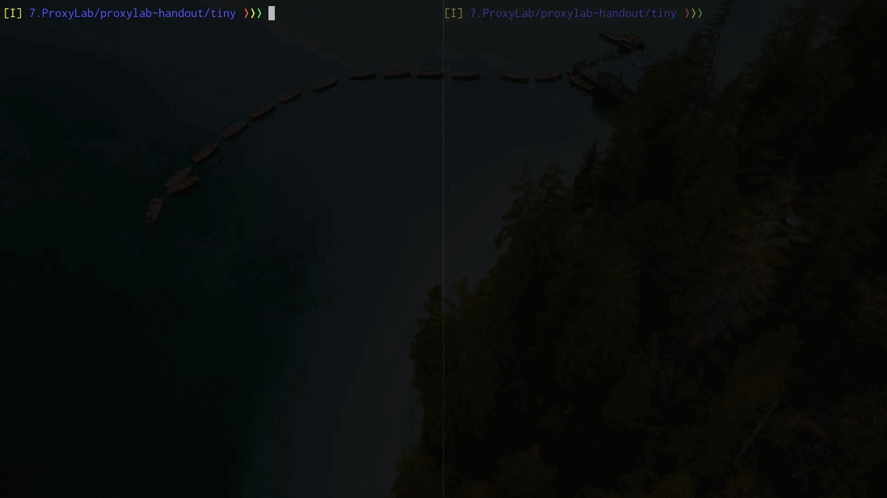

## Tiny Web Server

### Description

- **Tiny** is small, *iterative* HTTP/1.0 web server.

- **Tiny** uses the `GET` method to serve static content
(`text`, `HTML`, `GIF`, and `JPG` files) out of `./` and to serve dynamic
content by running `CGI` programs out of `./cgi-bin`. The default 
page is `home.html` (rather than `index.html`) so that we can view
the contents of the directory from a browser.

- **Tiny** is neither secure nor complete, but it gives students an
idea of how a real Web server works. *Use for instructional purposes only*.

### How Tiny is Implemented

- The `main` routine: 
(1) opens a listening port for connections, then 
(2) accepts a connection, then 
(3) serve the client.

- Serving the client is done by: 
(1) reading the request line and headers, then 
(2) parsing URI form GET request, then 
(3) determinig whether it's a static or dynamic and serve it.

- I used [suckless coding-style](https://suckless.org/coding_style/).

### How To Use Tiny

1. Compile and run Tiny
````
git clone https://github.com/Alighorab/Tiny-Web-Server/
cd Tiny-Web-Server
make
./tiny <port> (e.g., 8000)
````

2. Connect to Tiny
- Using `TELNET`:
````
telnet localhost <port>
````
- Using your web browser:
````
http://localhost:<port>/
````

3. Send HTTP requests
- Using `TELNET`:
<p align="center">
  
</p>

- Using your web browser: 
<p align="center">
  
</p>

### Files

- `tiny.c`: The Tiny server
- `lib.{c,h}`: I/O and socket-interface functions
- `Makefile`: Makefile for tiny.c
- `home.html`: Test HTML page
- `godzilla.gif`: Image embedded in home.html
- `cgi-bin/adder.c`: CGI program that adds two numbers
- `cgi-bin/Makefile`: Makefile for adder.c
